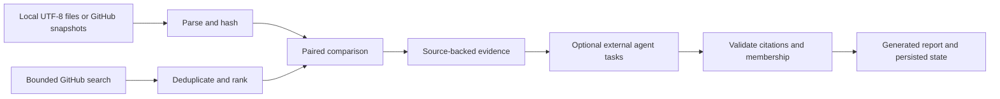

# Architecture

SkillVariants is a Python CLI with a static example explorer. The deterministic comparison core is useful on its own.

## Modules

| Module | Responsibility |
|---|---|
| `parser.py` | Parse Skill frontmatter/body and GitHub references |
| `github.py` | GitHub authentication, bounded search, immutable fetches, cache provenance |
| `similarity.py`, `features.py`, `ranking.py` | Explainable textual and structural heuristics |
| `comparison.py` | Pure paired hunks over raw source lines; bounded output and explicit truncation |
| `cli_helpers.py` | Production evidence assembly; one distinct normalized candidate per group |
| `study/tasks.py`, `study/evidence.py` | Task contracts and exact paired citation validation |
| `study/runtime.py`, `study/storage.py` | State transitions, complete coverage, locking, journal recovery, snapshots |
| `study/reporting.py` | Deterministic report structure and counts; quoted agent interpretations |
| `web/` | Original, precomputed teaching examples; no service or model calls |

GitHub source metadata records requested and resolved references, raw hashes, capture time and snapshot location. Mutable search/file lookups have bounded cache freshness. Raw file bytes remain separate from normalized deduplication hashes.

The study id includes target identity, corpus fingerprint and protocol version. Immutable evidence and owned snapshots are published through staged directory creation. Mutable transitions run under a process lock and rollback journal. Task generations prevent a replaced upstream result from accepting an old downstream answer.

The runtime's limits and protocol are documented in [agent-runtime.md](agent-runtime.md). The [evaluation protocol](evaluation.md) concerns semantic judgments; unit tests alone cannot establish their accuracy.
